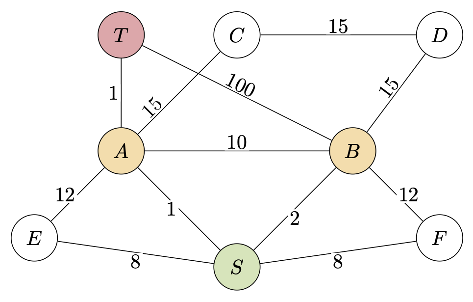

# The Torchbearer

**Student Name:** Monica Lester

**Student ID:** 132761938

**Course:** CS 460 – Algorithms | Spring 2026

---

## Part 1: Problem Analysis

- **Why a single shortest-path run from S is not enough:**
  
  We cannot determine the most fuel-efficient path to grabbing all the relics in the dungeon with a single
  shortest-path run.
  
  A single shortest-path run would tell us the most fuel-efficient path to each node, but cannot decide the 
  best order in which to visit them, with our main goal in mind.
  
- **What decision remains after all inter-location costs are known:**
  
  Once we know all inter-location costs, we must decide the order in which to traverse the nodes to collect 
  all relics using the least fuel.

- **Why this requires a search over orders:**
  
  Since we want to find the path to all relics using the minimum amount of fuel, and there are multiple visitation orders to the necessary nodes, all with different fuel costs/distances, we must search through these different orders to find that which is most efficient.

---

## Part 2: Precomputation Design

### Part 2a: Source Selection

| Source Node Type | Why it is a source |
|---|---|
| start_node (S) | We must start at the entrance (node S), and find all shortest paths to each relic, so (S) is our "base" starting node. |
| relic_node | Once we reach our first relic node traversing from S, that relic node now becomes our new source node to find the most efficient path to the next relic node - rinse and repeat until we reach the exit (T). |

### Part 2b: Distance Storage

| **Property** | **Your answer** |
|---|---|
| *Data structure name* | (Nested) Dictionary/Hash map |
| *What the keys represent* | key_i (outer key)= source node, key_j (inner) = terminal node |
| *What the values represent* | shortest path distance between key_i -> key_j|
| *Lookup time complexity* | $\mathcal{O}(1)$|
| *Why $\mathcal{O}(1)$ lookup is possible* | The lovely average time-complexity of hash maps - constant time - what a wonderful thing it is. |

### Part 2c: Precomputation Complexity

Note the variables $n=|V|,m=|E|$, and $k=|M|$.

- **Number of Dijkstra runs:** $k+1$
  - $k$ runs to search from each relic node, and then an additional one for checking the spawn node.
- **Cost per run:** $\mathcal{O}(m\log(n))$ 
  - Time complexity of one Dijkstra search per assignment instructions.
- **Total complexity:** $\mathcal{O}((k+1)m \log(n))$
  - (number of runs) $\times$ (cost per run) = $(k+1)\times \mathcal{O}(m \log (n))$, which gives us the above.
- **Justification:** We must run a Dijkstra search on the spawn node and all relic nodes, and to do this, we will iterate through M (the set of relic nodes), and add on the one additional search on the spawn node, and since a single Dijkstra search has a time complexity of $\mathcal{O}(m \log(n))$, then we have a total complexity of $\mathcal{O}((k+1)m \log(n))$ for precomputing the distances of relevant nodes in the graph.

---

## Part 3: Algorithm Correctness

### Part 3a: What the Invariant Means

- **For nodes already finalized (in S):**
  For some node $n\in S$, `min_node_dist[n]` is the *shortest possible path* to take from the source node to $n$. This distance will not change again.

- **For nodes not yet finalized (not in S):**
  For some node $n \notin S$, `min_node_dist[n]` is the shortest path *we have encountered* from the source node to $n$. If a new shorter path is encountered, the `min_node_dist[n]` will be updated with that new path.

### Part 3b: Why Each Phase Holds

- **Initialization: why the invariant holds before iteration 1:**
  - 'dist[source]' = 0, and for all $n \in V$, `min_node_dist[n]` $\geq 0$.
  - We have not visited any nodes (other than the source which we established the final distance of as 0), so the shortest path between them and the source could be some unknown, infinitely large value, hence `min_node_dist[n]` = $\infty$ and the invariant holds.

- **Maintenance: why finalizing the min-dist node is always correct:**
  - We always pick the node with the smallest current `min_node_dist[n]` via the min heap/priority queue.
  - Since all edge weights are nonnegative, any other path to this node would have to go through nodes with equal or larger distances, so it can’t end up being shorter.

- **Termination: what the invariant guarantees when the algorithm ends:**
  - The invariant guarantees that `min_node_dist[n]` will hold the finalized shortest possible paths between the source node and all other (reachable) nodes in the graph. 

### Part 3c: Why This Matters for the Route Planner

We must be able to trust that our list of shortest paths is correct when comparing relic orders so that we avoid accidentally taking an longer path when traversing the graph from spawn to exit, picking up all the relics as we go.

---

## Part 4: Search Design

### Why Greedy Fails

  

- **The failure mode:** 
  - A locally cheap choice (i.e. next closest relic) can domino and force far more expensive choices in the future.
- **Counter-example setup:** 
  - Consider the graph above. We spawn at node $S$, nodes $A$ and $B$ contain relics, and the exit is at node $T$. Note that, in this example, all graph edges are bidirectional. 
  
- **What greedy picks:** 
  - Since $S \to A < S \to B$, greedy will choose to go to node $A$ first.
- **What optimal picks:** 
  - Optimal will pick the path starting from $B$: $S \to B \to S \to A \to T$
- **Why greedy loses:** While $A$ is closer to $S$ than $B$, the total path from $S \to B \to S \to A \to T = 6$ is much cheaper than any option where we traverse to $A$ before $B$. For example:
  - Greedy Path $(i)$: $S \to A \to S \to B \to \to S \to A \to T = 8$.
  - Greedy Path $(ii)$: $S \to A \to B \to T = 111$
  - Greedy Path $(iii)$: $S \to A \to B \to A \to T = 22$.
  - etc.
So greedy loses because choosing the closest relic $A$ first results in a more expensive order overall.

### What the Algorithm Must Explore

- It should explore different **orders** of visiting relic nodes, starting from the spawn node and finishing at the exit node, to determine which relic visit order produces the most optimal path. 

---

## Part 5: State and Search Space

### Part 5a: State Representation

| **Component** | **Variable name in code** | **Data type** | **Description** |
|---|---|---|---|
| *Current location* | `current_loc` | `node` | A variable which holds a pointer to the current location within the graph where we are searching. |
| *Relics already collected* | `relics_remaining` | `set` (of relic nodes) | An unordered set which holds pointers to all the relics which have not been collected in the current relic order collection check. (*Note*: There seems to be a discrepancy between the `README.md` file template and the code in `torchbearer.py`. This is asking me to name the variable which notes the relics *already* collected, which I am interpreting as the variable which would drive decision making for pathing to the next relic, but the only parameter in `_explore(d_t,c_l,r_r,r_v_o,c_s_ff,e_n,b)` which would do that is `relics_remaining`, which is a collection of the relics which have *not yet* been visited -- not those which have already been collected. I will be keeping the parameter name as is, in `torchbearer.py`, and implementing it with the interpretation of relics which have *not* been collected yet, as I anticipate that will work better functionally for how I am planning to code the function, but I wanted to make note of this since my response contradicts what the component I was asked to describe is.) |
| *Fuel cost so far* | `cost_so_far` | `float` | A `float` which sums the total distance/fuel burned throughout the order check. |

### Part 5b: Data Structure for Visited Relics

| **Property** | **Your answer** |
|---|---|
| *Data structure chosen* | `set` |
| *Operation: check if relic already collected* | Time complexity: $\mathcal{O}(1)$ average, `relic not in set` (*see note in Part 5a*)|
| *Operation: mark a relic as collected* | Time complexity: $\mathcal{O}(1)$ average, `set.remove(relic)`|
| *Operation: unmark a relic (backtrack)* | Time complexity: $\mathcal{O}(1)$ average, `set.add(relic)` |
| *Why this structure fits* | A set is a good data structure, since I only need to note what relics we have not yet visited without needing any other information about them (e.g. adjacent nodes, their edge weights between neighbors, etc.), and sets have efficient methods (as seen above) for adding, removing (so we have efficient methods for backtracking), and checking if a specific node is contained within the set. |

### Part 5c: Worst-Case Search Space

- **Worst-case number of orders considered:** $k!$
- **Why:** Since at each step `_explore(...)` recursively picks one of the remaining ones to visit next, in the worst case, it would end up trying every possible ordering of the relics, i.e. all permutations of a set of size k $\Longrightarrow k!$ orders considered.
---

## Part 6: Pruning

### Part 6a: Best-So-Far Tracking

- **What is tracked:** The minimum traversal cost found so far for a complete traversal route from the spawn node, through all relics, to the exit node, along with the visiting order that produces it.
- **When it is used:** When a new visiting order is checked, if at any point during recursion the current traversal cost becomes greater than or equal to the best cost found so far, we abandon that traversal and move on to checking the next possible ordering.
- **What it allows the algorithm to skip:** Any visiting orders that would result in a higher total traversal cost than the current best ordering.

### Part 6b: Lower Bound Estimation
<!--
- **What information is available at the current state:** 
  - relics which have not yet been visited (`relics_remaining`);
  - order of relics visited so far (`relics_visited_order`);
  - current cost of visting order which is currently being checked, i.e. amount of fuel which has been used in current traversal path (`cost_so_far`);
  - current location within the graph (`current_loc`), most cost efficient visitng order found so far (`best`)
- **What the lower bound accounts for:** The current location within the graph, fuel burned so far in current traversal, an estimated minimum amount of fuel needed to visit remaining relic nodes and make it to the exit node.
- **Why it never overestimates:** Using the distance table, we estimate the remaining fuel using the shortest/cheapest possible distances between nodes, so we are effectively assuming the best-case completion of the traversal. Since any valid route must incur at least these costs (and typically more when accounting for visiting all remaining relics), the true cost of the traversal is always greater than or equal to the lower bound.
-->

- **What information is available at the current state:** 
  - relics which have not yet been visited (`relics_remaining`);
  - order of relics visited so far (`relics_visited_order`);
  - current cost of the visiting order being checked (i.e. fuel used so far, `cost_so_far`);
  - current location within the graph (`current_loc`);
  - and the best solution found so far (`best`).

- **What the lower bound accounts for:** 
  - The current location within the graph;
  - fuel burned so far in the current traversal;
  - and an estimated minimum amount of fuel needed to visit the remaining relic nodes and make it to the exit node.

- **Why it never overestimates:** Using the distance table, we estimate the remaining fuel using the shortest/cheapest possible distances between nodes, so we are effectively assuming the best-case completion of the traversal. Since any valid route must incur at least these costs (and typically more when accounting for visiting all remaining relics), the true cost of the traversal is always greater than or equal to the lower bound.

### Part 6c: Pruning Correctness

- Since the lower bound is the *minimum possible* amount of fuel required to complete a traversal (and often an underestimate), then if that lower bound is ever $\geq$ `best[0]` = fuel cost of current best visiting order, then we can immediately abandon the current visiting order since there is no possible way for it to end up being the actual minimal path (best) to take. 
- At best, it could be equivalent to the cost of the current best, but in that case, since we are not getting any greater returns, we need not continue exploring that branch and can instead stick with the current best which we have already calculated the pathing and cost of.

---

## References

- CS 460 Graphs Practice Quiz
- *Algorithm Design Manual, 3rd Ed,*, Skiena (Chapters 7, 8, 9)
